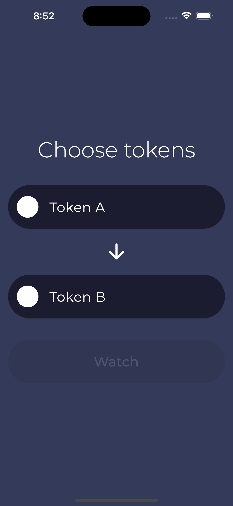
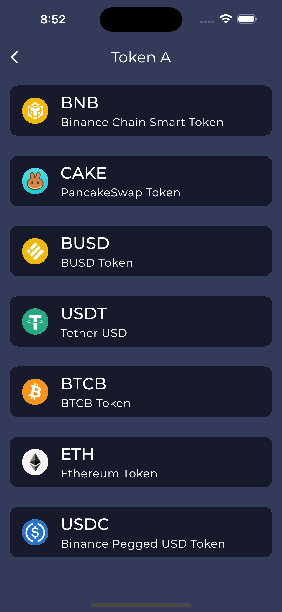
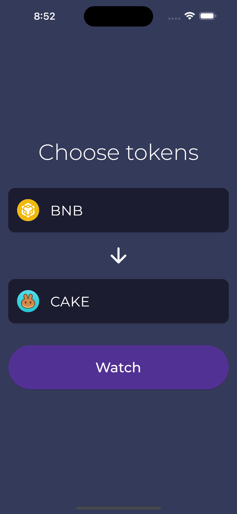
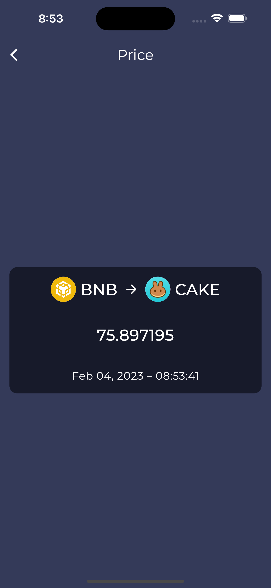

# Pancake Swap Exchange
Flutter application for displaying the exchange rate in the BNB network of token A to token B on PancakeSwap.

### Stack
- Web3dart
- PancakeSwap
- Bloc + Freezed

## Screenshots
1. Choose tokens pair.

2. Choose token.

3. Choosen pair.

4. Exchange rate with update currency every 5 seconds.

